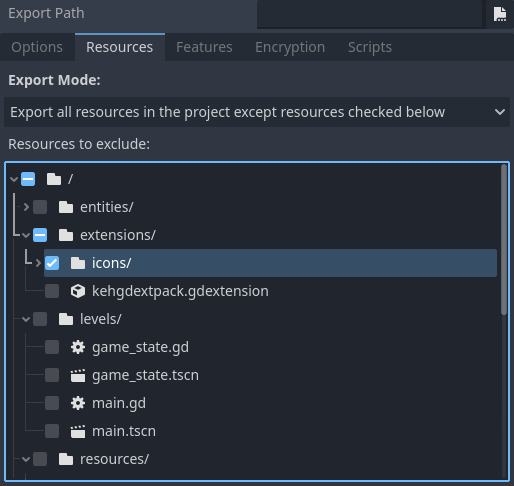
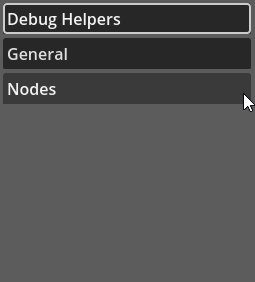
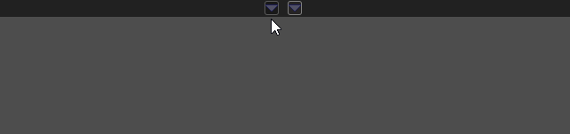
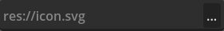
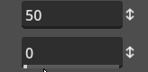
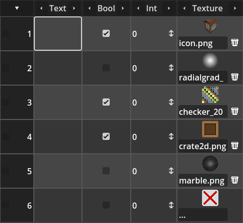
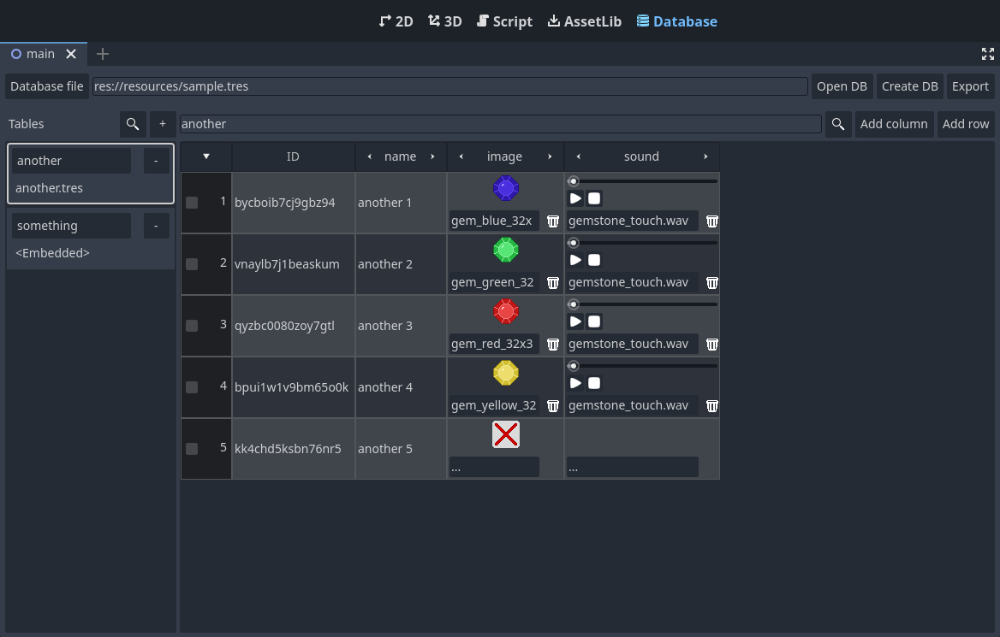

# Kehom's GDExtension Pack

This repository contains the (C++) source code for a collection of plugins for the [Godot Engine](https://godotengine.org/) 4, "packed" into a GDExtension.

The extension requires Godot 4.3+ version to work. In this regard, the extension API (*godot-cpp*) is considered *beta* at the moment. As such, *if* the API breaks compatibility changes in order to fix serious issues (while under *beta stage*) then there is the possibility that this pack will also break compatibility. Minimum Godot version *might* be bumped too. Please note that I will still do my best to avoid this situation.

For the most part this is a port (and improvement) of the pure GDScript addon pack for the 3.2+ version of Godot Engine, which can be found [here](https://github.com/Kehom/GodotAddonPack).

# Installation

Installation is a relatively simple process:

1. Make sure Godot Engine is not running with your project open.
2. Copy the binary files into the project directory or, better yet, in any subdirectory of the project.
3. Opening you project in Godot should now load the plugins and *maybe* a restart will be needed, which Godot will notify about.

Note that the distribution pack contains several icons that are meant to be displayed within the Godot Editor, more specifically when dealing with custom Nodes. You can completely exclude these icons when you export the project for distribution, since those are used only in editor.

# Compiling and Customization

In order to compile the code in this repository there are two requirements, besides a working modern C++ compiler:

1. [scons](https://scons.org/)
2. [godot-cpp](https://github.com/godotengine/godot-cpp) - take the 4.3 branch

Copy (or clone) the contents of the *godot-cpp* repository into the *godot-cpp* subdirectory of this project then run *scons*!

The build script in this project provides several options to customize the resulting binary. Namely you can disable plugins you know you wont use, as long as those are not internal dependencies for other plugins that you intend to use. That said, to disable a feature a "variable" should be set when calling *scons*, much like `scons some_feature=0`.

> Please note, there is a known issue when using custom variables, which is explained in the *Known Issues* section of this readme.

Instead of setting a variable for each feature you want disabled in the command line, it's possible to create a "profile" file and provide it through `scons profile=some_profile.py`. In this repository you can find three such profile files, *prof_debug.py*, *prof_release.py* and *prof_testing.py*. The first contains the default settings for the build used in editor, while the second file contains default settings used for the build that should be distributed with your game. I use the *prof_testing.py* primarily for testing multiple build settings.

Those profile files contains almost all available variables with comments above them explaining what they are. By the way, the commands in the *tasks.json* (see the *Visual Studio Code* topic) use those profiles!

Bellow are the available variables that are not used in any of the *prof_x.py* files:

* `copy_bin_to_demo` - This is false by default. However if set to true then the files in the *bin* directory will be copied into the demo project as part of the build process. This option is enabled in the *tasks.json* as it makes iteration/testing way easier during development.

If you are cross-compiling from Linux to Windows, please read Godot's documentation, more specifically the troubleshooting topic as it also applies to the compilation of this extension pack: https://docs.godotengine.org/en/stable/contributing/development/compiling/compiling_for_windows.html#troubleshooting

# The Plugins

I have attempted to organize the files/plugins into categories, which should reflect in the subtopics bellow. That said, the list of available plugins, with a bit of information of what to expect comes in this topic.

## Debug Helpers

The plugins found in this category are meant primarily to help debug the project. By default those are built in a way that you don't need to remove script code that use them. Reason for this is that in release builds these debug classes are empty. In other words, calling the provided functions will do nothing in release builds (this behavior can be changed through compilation options). That said, the available plugins in this category are:

### Line3D

Available compile options:
- `line3d_enabled` - if set to `0` then this plugin will be completely removed from the final binary
- `line3d_empty` - this is set to `0` in *debug* builds and `1` in *release* builds. When `1` the various functions will do absolutely nothing.

Provide means to draw lines in 3D. Using the default `add_line()` function will draw a line that lasts for a single frame. There is the option add lines that remain on screen for a specified amount of seconds.

### OverlayInfo

Available compile options:
- `overlayinfo_enabled` - if `0` then this plugin will be completely removed from the final binary
- `overlayinfo_empty` - set to `0` in *debug* builds and `1` in *release* builds. When `1` the various functions will do absolutely nothing.

I found myself constantly creating temporary UI controls (`Label`) to dump text into screen, specially when trying to debug networked values, which becomes rather tedious after some time. This plugin offers means to quickly add text into the screen, including timed labels that will be removed after a specified amount of seconds.

## General

Plugins that are relatively simple/small that don't exactly fit into more specialized category.

### Quantize

Available compile options:
- `quantize_enabled` - set to `0` to completely remove this plugin from the final binary.

Provides means to quantize (lossy compression) floating point numbers as well as compress rotation quaternions using the *smallest three* method. The entire functionality is provided through static functions, meaning that it's not necessary to create instances of the class (`Quantize`). Although the returned quantized data are still using the full GDScript variant data, the resulting integers can be packed into others through bit shifting and masking.

## Nodes

Plugins in this category bring new Nodes to Godot. However none of those are UI Widgets, which are in the *UI* category.

### AudioMaster

Available compile options:
- `audiomaster_enabled` - if `0` then this plugin will be completely removed from the final binary

Audio playback is relatively easy, done by using the `AudioStreamPlayer` node. However, often we need to take node lifetime into account otherwise the playback will be cut. One very common case for this is when the stream player is attached into a pickup or a node that will soon be removed from the scene, like a projectile for example. This plugin aims to provide means to playback audio through stream player *pools*. There are also some other utilities to make it easier to achieve:

- Music cross fading.
- Audio volume sliders dealing with percent instead of dB.
- Dealing with Audio Bus names instead of indices.

### AutoInterpolate

Available compile options:
- `autointerpolate_enabled` - This is related to a node that will automatically interpolate a set of nodes based on a configurable target. This single node can deal with both 2D and 3D.
- `smooth2d_enabled` - Allow disabling `Smooth2D`, which is specifically meant for interpolating 2D nodes.
- `smooth3d_enabled` - Allow disabling `Smooth3D`, which is specifically meant for interpolating 3D nodes.

This plugin is largely based on [Lawnjelly's Smoothing Addon](https://github.com/lawnjelly/smoothing-addon). Yet there are several differences not only to the original Lawnjelly's work, but also to my GDScript version too:

* Each component of the transform (translation, orientation and scale) can be individually set to either fully interpolate, don't interpolate or completely ignore.
* There is one Node (`AutoInterpolate`) that can be used for both 2D and 3D, depending on the target node, which can be chosen. This node will optionally interpolate its children and also an optional list that can be assigned within the editor.
* All three Nodes provided here use global transform which ensures correct behavior regardless of the hierarchy.

### RadialImpulse

Available compile options:
- `radial_impulse2d_enabled` - allow removal of the 2D specific node of the plugin
- `radial_impulse3d_enabled` - allow removal of the 3D specific node of the plugin

Provide means to apply an impulse into all physical objects that are within a specified radius, from the location the radial impulse node is located at. Optionally the impulse magnitude can be reduced the further it is from the center.

## UI

Custom UI Control nodes are in this category.

### Accordion

Available compile options:
- `accordion_enabled` - allow removal of this Control

The `Accordion` is a Control borrowing something that is typically found on web development UIs. The idea of this Control is to provide "category buttons" that can toggle visibility of additional content placed bellow those buttons. Animation can be used to show/hide those contents. `Curve` resources can be used to control how those animations will play.

### Expandable Panel

Available compile options:
- `expandable_panel_enabled`- allow removal of this Control

This is a [Container](https://docs.godotengine.org/en/stable/classes/class_container.html) that automatically attaches itself into a side of its owning parent `Control`. Each child widget of the `ExpandablePanel` generates a "page" and a toggle button. Clicking the toggle button contracts/expands the panel into/from the attached side, hiding/showing the corresponding "page" contents. `Curve` resources can be used to determine how the animations will play.

### File/Directory Picker

Available compile options:
- `filedir_picker_enabled` - allow removal of this Control from final build

This offers a relatively simple control that contains a text and a button. Clicking the button brings a file/directory dialog and once something is selected that text will hold the selected value. In other words, this wraps a `LineEdit`, a `Button` and a `FileDialog`.

### Spin Slider

Available compile options:
- `spin_slider_enabled` - allow removal of this Control

Implements a control similar to `SpinBox` but if a well defined value range is specified then a slider will be shown bellow the value "text". It's also possible to hide the spin button if the slider is shown.

### Tabular Box

Available compile options:
- `tabular_box_enabled` - allow removal of this Control

This Control brings tabular data viewing and editing capabilities. To increase its flexibility, it relies on Data Sources, which are resources implemented by users in order to provide the data to be rendered. When editing, the widget will directly interact with the assigned data source. This means that the actual data storage is entirely up to the project needs. A relatively simple data source implementation is provided out of the box.

The editing and rendering is controlled by specialized *Cells*. Custom ones can be implemented in order to bring additional capabilities to the Control.

## Other

In this category some "bigger" plugins are found. Those might even contain specialized editors. Typically the plugins in here depends on at least one other plugin in this pack.

### Database

Available compile options:
- `database_enabled` - allow complete removal of this plugin

This plugin uses Godot resource system to implement a ("relational") database system. For easier creation/editing/management of the database there is an editor plugin that requires the `TabularBox` UI plugin.

Please note that this is meant to provide data exclusive to game projects. It's **not** meant to be used to store user data!

# Tutorial/Documentation

Reference documentation is part of the build and can be consulted directly within the Godot editor. For a more practical usage information, refer to my personal web page [Kehom's Forge](http://kehomsforge.com/tutorials/multi/gdextension-pack)

# Demo Project

The demo project is meant to showcase the addons that are included in this pack. It's very important to note that it assumes the "pack" is built using the default settings. If a custom build that excludes addons is used then the project will not work properly and most likely Godot will spit several error messages.

Another thing to note, the project is configured for compatibility mode (OpenGL). There are two reasons for this:

- It allows people who don't have Vulkan capable machines to run the Demo.
- My old laptop, which is one of my dev and testing machines, does not support Vulkan.

# Visual Studio Code

This is the editor I use to work on the code found here. To make things easier I have created a *tasks.json* file to "fire up" *scons* or Godot, with arguments to directly edit (or run) the demo project. The "base" of this file can be found in this repository, although it does require some editing if you intend to use it on your own. To use it:

1. Copy the *tasks.json* file into the *.vscode* subdirectory of the project, where the files of this repository resides. Create said subdirectory if it doesn't exist.
2. Edit the copied file and update the various `command` fields to properly call the executables. More specifically, if you don't have those things in environment variables, you will probably have to add full path to the executables. Alternatively create symbolic links in the project directory.

After the file is properly edited, you can press *Ctrl+Shift+B* to build the debug version of the pack, which is required to use in editor. You can also use *Ctrl+Shift+P* then *Run Task* to choose which of the configured tasks should be performed. The tasks are:

- Build debug build for current running operating system.
- Build release build for current running operating system.
- Cross compile debug build from Linux to Windows.
- Cross compile release build from Linux to Windows.
- Generate "doc_classes" (documentation).
- Edit Demo. This basically directly opens the demo project within the Godot editor.

# Known Issues

* Custom `Control` theme entries are not automatically populated in the Theme Editor. This happens because I had to work around a [limitation](https://github.com/godotengine/godot-cpp/issues/1332) in Godot's theme system. Unless a fix to that problem is back ported to Godot 4.3, this will be an unfortunate limitation of this extension pack as well. Theme overrides through the Inspector work as expected though. Yet, to help alleviate the problem, I have created a small editor tool that generates a `Theme` resource containing all custom control theming holding the default values (click on menu `Project -> Tools -> Custom Control Theme Generator`).
* Providing custom SCons build settings will result in a "warning" message telling about unknown variable. More specifically `WARNING: Unknown SCons variables were passed and will be ignored:`. This is a [problem](https://github.com/godotengine/godot-cpp/issues/1334) with *godot-cpp* build script. This warning can be ignored if the variable settings are correct and specific to the Extension Pack.
* There are several dialogs shown in the Database editor. Those can be minimized without being fully closed, showing a box at the lower left corner of the editor. This behavior is a bit weird and is the exact same one of core dialogs. I couldn't find a way to disable those buttons without completely removing the border of the dialogs.
* Currently there isn't a proper way to generate C# bindings for GDextensions. While partial access is possible through `ClassDB`, I realize it's not ideal. Moreover, it imposes a limitation in the fact that it's not possible to extend any of the extension classes with C# code.
